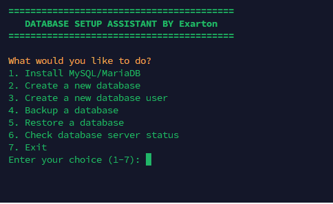

# EasyDBGenerator for VPS 🐢

A simple shell script to install **MySQL/MariaDB** on your VPS — for lazy people who just want it done.

## 🚀 Features

- Installs MySQL or MariaDB quickly  
- Runs on most Debian/Ubuntu-based VPS setups  
- Zero-brain setup, just copy-paste and chill  

## 🧠 Requirements

- A fresh VPS (root access)  
- Internet connection  
- Debian/Ubuntu OS  

## 🔧 Script Preview

  

